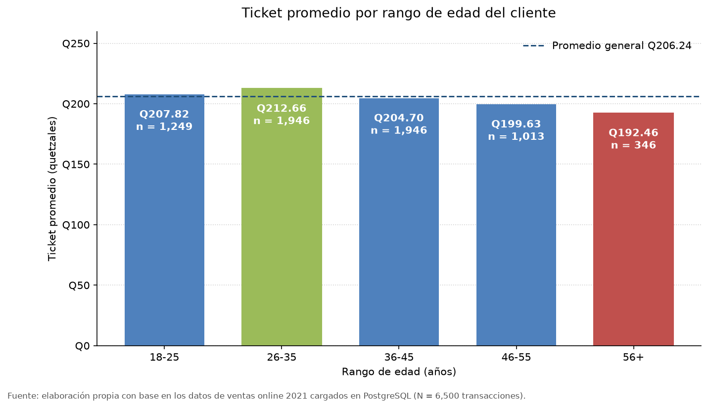
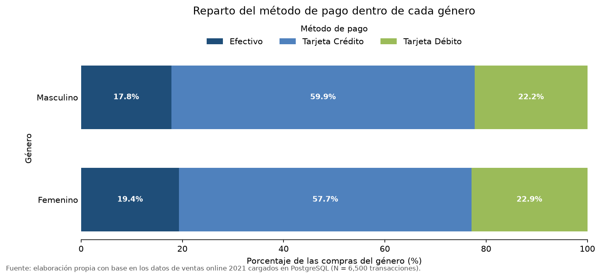
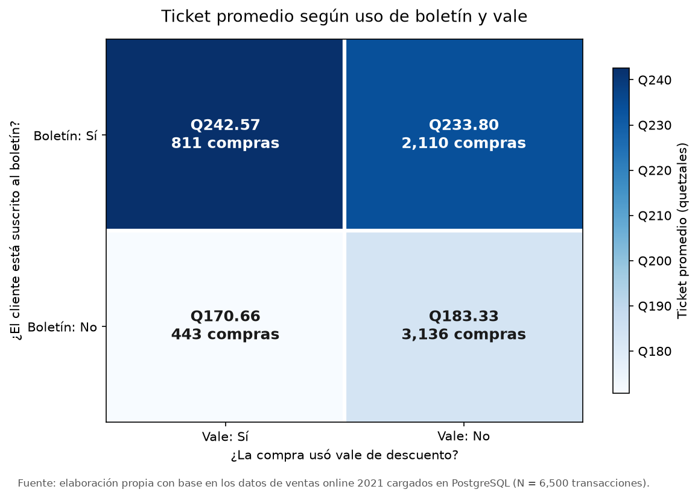
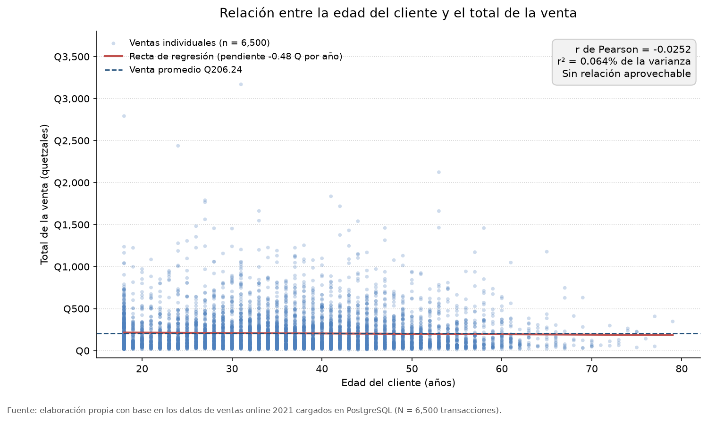

[ ← Regresar ](../README.md)

# Segmentación de clientes y análisis de correlación

Bloque correspondiente a los puntos **4** y **5** del alcance de la práctica, y a
cuatro de las nueve visualizaciones del punto **6**.

Todas las cifras de este documento proceden de consultas SQL ejecutadas contra la
base PostgreSQL en la nube y se reproducen por completo ejecutando:

```bash
python analisis/segmentacion.py
```

## Índice

- [Nota previa sobre la estructura de los datos](#nota-previa-sobre-la-estructura-de-los-datos)
- [4. Segmentación de clientes](#4-segmentación-de-clientes)
  - [4.a Agrupación por edad](#4a-agrupación-por-edad)
  - [4.b Comportamiento de compra entre géneros](#4b-comportamiento-de-compra-entre-géneros)
  - [4.c Agrupación por boletín y vale](#4c-agrupación-por-boletín-y-vale)
- [5. Análisis de correlación](#5-análisis-de-correlación)
  - [5.a Total de la venta frente a edad del cliente](#5a-total-de-la-venta-frente-a-edad-del-cliente)
  - [5.b Género frente a método de pago](#5b-género-frente-a-método-de-pago)
  - [5.c Boletines frente a vales](#5c-boletines-frente-a-vales)
- [Síntesis del bloque](#síntesis-del-bloque)
- [Limitaciones](#limitaciones)

## Nota previa sobre la estructura de los datos

Antes de segmentar conviene dejar constancia de un rasgo del conjunto de datos que
condiciona todo lo que sigue: **cada cliente registra exactamente una venta**. Las
6,500 filas de la tabla `venta` corresponden a 6,500 valores distintos de
`id_cliente`, de modo que «cliente» y «transacción» son la misma unidad de
observación.

Esto tiene dos consecuencias prácticas. La primera es que no existe historial por
cliente: no se puede medir recurrencia, frecuencia ni valor de vida, y cualquier
segmentación es necesariamente una fotografía de una sola compra. La segunda es
que el «ticket promedio» de un segmento y su «gasto por cliente» son el mismo
número, lo que simplifica la lectura pero impide distinguir a un cliente que gasta
mucho una vez de uno que gastaría poco muchas veces.

La columna `num_compra` sí existe y promedia 5.09, lo que sugiere que el sistema de
origen sí lleva ese conteo; pero al haber una sola fila por cliente no es posible
reconstruir esas compras anteriores ni sus montos.

## 4. Segmentación de clientes

### 4.a Agrupación por edad

Se agruparon los 6,500 clientes en cinco tramos etarios. El rango observado va de
los 18 a los 79 años, con una media de 36.3 años, por lo que no existe el tramo de
menores de 18 que el esquema contempla.

| Rango | Clientes | % del total | Ticket promedio | Mediana | % con boletín | % con vale |
| :--- | ---: | ---: | ---: | ---: | ---: | ---: |
| 18-25 | 1,249 | 19.2 % | Q207.82 | Q136.50 | 40.6 % | 17.1 % |
| 26-35 | 1,946 | 29.9 % | Q212.66 | Q145.30 | 48.2 % | 20.3 % |
| 36-45 | 1,946 | 29.9 % | Q204.70 | Q136.45 | 48.9 % | 20.4 % |
| 46-55 | 1,013 | 15.6 % | Q199.63 | Q132.90 | 37.6 % | 17.4 % |
| 56+ | 346 | 5.3 % | Q192.46 | Q123.75 | 41.3 % | 20.8 % |



**Lo que dice el gasto.** Existe una tendencia descendente ordenada a partir de los
26 años: el ticket baja de Q212.66 a Q192.46 conforme sube la edad. Pero la brecha
entre el tramo que más gasta y el que menos es de **Q20.21**, un 10.5 % sobre la
base más baja, y las cinco barras se apoyan sobre la línea del promedio general de
Q206.24. Ningún tramo se despega. Para dimensionarlo: la diferencia entre el
segmento más rentable y el menos rentable equivale a menos de un tercio de lo que
separa a un suscriptor del boletín de quien no lo es (Q54.47, ver 4.c).

El tramo 56+ merece una advertencia metodológica. Es el ticket más bajo de la
tabla, pero también el grupo más pequeño con 346 clientes: sobre esa base, una
docena de compras atípicas mueve el promedio varios quetzales. La mediana confirma
la dirección —Q123.75 frente a Q145.30 del tramo 26-35— así que la tendencia es
real, solo que su magnitud es pequeña y su segmento, marginal.

**Dónde sí hay una diferencia aprovechable.** El hallazgo útil de esta segmentación
no está en el gasto sino en la última columna. La penetración del boletín no es
pareja: alcanza el 48.9 % en el tramo 36-45 y apenas el 37.6 % en el de 46-55, once
puntos porcentuales de diferencia. Como el boletín es la única variable del conjunto
de datos que separa clientes por gasto de forma sustantiva, esa desigualdad de
cobertura sí es accionable, y lo es precisamente en el tramo que hoy registra el
segundo ticket más bajo.

Los tramos 26-35 y 36-45 concentran juntos el 59.8 % de los clientes y casi la
misma proporción de la facturación. La empresa no tiene un problema de captación
etaria: tiene una base concentrada en adultos de 26 a 45 años que se comportan de
forma prácticamente idéntica.

### 4.b Comportamiento de compra entre géneros

| Indicador | Masculino | Femenino | Diferencia |
| :--- | ---: | ---: | ---: |
| Compras | 3,372 | 3,128 | 244 |
| Ticket promedio | Q204.46 | Q208.16 | Q3.70 (1.8 %) |
| Ticket mediano | Q137.30 | Q137.60 | Q0.30 |
| Edad promedio | 36.4 años | 36.2 años | 0.2 años |
| Compras con boletín | 44.6 % | 45.3 % | 0.7 pp |
| Compras con vale | 19.0 % | 19.6 % | 0.6 pp |

Reparto del método de pago **dentro** de cada género, que es la comparación
correcta al tratarse de grupos de distinto tamaño:

| Género | Efectivo | Tarjeta de crédito | Tarjeta de débito |
| :--- | ---: | ---: | ---: |
| Masculino | 17.8 % | 59.9 % | 22.2 % |
| Femenino | 19.4 % | 57.7 % | 22.9 % |



El gráfico es deliberadamente aburrido, y esa es la conclusión. Las dos franjas son
casi indistinguibles: la mayor brecha en cualquier método de pago es de **2.2 puntos
porcentuales**, y la mediana de gasto difiere en **Q0.30**. Cuando la media y la
mediana coinciden en señalar una diferencia mínima, se puede descartar que el
promedio esté siendo arrastrado por valores atípicos.

Hombres y mujeres compran por los mismos canales, pagan igual, tienen la misma edad
promedio y responden al boletín y al vale en proporciones equivalentes. El género no
describe dos comportamientos de compra distintos: describe el mismo comportamiento
dos veces. El contraste estadístico del punto 5.b confirma formalmente esta lectura.

### 4.c Agrupación por boletín y vale

Este es el cruce que sí separa clientes. Las cuatro combinaciones posibles:

| Boletín | Vale | Compras | % del total | Ticket promedio | Facturación | % de la facturación |
| :---: | :---: | ---: | ---: | ---: | ---: | ---: |
| No | No | 3,136 | 48.2 % | Q183.33 | Q574,926.40 | 42.9 % |
| No | Sí | 443 | 6.8 % | Q170.66 | Q75,601.00 | 5.6 % |
| Sí | No | 2,110 | 32.5 % | Q233.80 | Q493,322.70 | 36.8 % |
| Sí | Sí | 811 | 12.5 % | Q242.57 | Q196,725.70 | 14.7 % |



El mapa de calor hace evidente de un vistazo que **la separación ocurre entre filas y
no entre columnas**: las dos celdas superiores (con boletín) son oscuras y las dos
inferiores (sin boletín) son claras, mientras que moverse de izquierda a derecha
—usar o no un vale— apenas cambia el tono. Quien manda es el boletín.

Agregando cada instrumento por separado:

| Grupo | Compras | Ticket promedio |
| :--- | ---: | ---: |
| Con boletín | 2,921 | Q236.24 |
| Sin boletín | 3,579 | Q181.76 |
| Con vale | 1,254 | Q217.17 |
| Sin vale | 5,246 | Q203.63 |

La diferencia por boletín es de **Q54.47 por compra, un 30.0 % más**. Los suscritos
son el 44.9 % de las transacciones del año pero aportan el **51.5 % de la
facturación** (Q690,048.40 de Q1,340,575.80). Menos de la mitad de las ventas
generando más de la mitad del dinero.

**El vale exige leerse con cuidado.** A primera vista parece sumar: quien usa vale
gasta Q217.17 y quien no, Q203.63. Pero ese agregado es engañoso, porque los
suscritos al boletín usan vale con mucha más frecuencia que los no suscritos (27.8 %
frente a 12.4 %, ver 5.c), de modo que la comparación directa está midiendo el
efecto del boletín disfrazado de efecto del vale. Es un caso de libro de la paradoja
de Simpson.

Al controlar por boletín el signo se invierte según el grupo:

| Grupo | Con vale | Sin vale | Efecto del vale |
| :--- | ---: | ---: | ---: |
| Clientes **sin** boletín | Q170.66 | Q183.33 | **−Q12.67 (−6.9 %)** |
| Clientes **con** boletín | Q242.57 | Q233.80 | **+Q8.77 (+3.8 %)** |

El mismo instrumento resta casi siete por ciento del ticket cuando se entrega a un
cliente no suscrito y suma casi cuatro por ciento cuando se entrega dentro del
boletín. Dicho de otro modo: el vale no funciona ni deja de funcionar, funciona
según a quién se le dé. Repartido fuera del boletín, la empresa está pagando un
descuento para obtener una compra más pequeña.

## 5. Análisis de correlación

Los tres contrastes se resolvieron sin dependencias externas: la correlación de
Pearson y la de Spearman se calculan en PostgreSQL y los valores *p* de las tablas
de contingencia (con 1 y 2 grados de libertad) tienen forma cerrada. Se usó el
umbral convencional α = 0.05.

### 5.a Total de la venta frente a edad del cliente

| Estadístico | Valor |
| :--- | ---: |
| Tamaño de muestra | 6,500 |
| Correlación de Pearson (r) | **−0.0252** |
| Correlación de Spearman (ρ) | −0.0298 |
| Varianza explicada (r²) | 0.064 % |
| Pendiente de la regresión | −Q0.48 por año de edad |
| Valor p | 0.0419 |



**No existe una relación aprovechable entre la edad y el gasto.** La nube de puntos
no tiene estructura: para cualquier edad entre 18 y 79 años se observan ventas desde
casi cero hasta más de Q1,000, y la recta de regresión es visualmente plana.

Este punto ilustra bien una distinción que conviene explicitar en un informe. El
contraste formal **sí rechaza** la hipótesis de correlación nula: p = 0.0419, por
debajo del 0.05 convencional. Sin embargo, r² indica que la edad explica el
**0.064 % de la variación del gasto**, es decir, seis centésimas de punto
porcentual. La pendiente estimada es de menos de medio quetzal por año: entre un
cliente de 20 y uno de 60 la regresión predice una diferencia de unos Q19, dentro
de un rango de ventas que llega a los Q3,169.

Con 6,500 observaciones, cualquier desviación mínima respecto de cero alcanza
significancia estadística. Significativo no es sinónimo de importante, y confundir
ambas cosas es la vía más rápida a una campaña cara construida sobre ruido. Se
calculó además la correlación de Spearman (−0.0298) para descartar que existiera una
relación monótona no lineal que Pearson no capturara: tampoco la hay.

**Conclusión operativa:** la edad no sirve para predecir cuánto va a gastar un
cliente ni, por tanto, para priorizar inversión comercial.

### 5.b Género frente a método de pago

Al ser dos variables categóricas, no aplica el coeficiente de Pearson. Se construyó
la tabla de contingencia y se midió la asociación con chi-cuadrado y V de Cramér.

| Género | Efectivo | Tarjeta de crédito | Tarjeta de débito | Total |
| :--- | ---: | ---: | ---: | ---: |
| Femenino | 606 | 1,806 | 716 | 3,128 |
| Masculino | 601 | 2,021 | 750 | 3,372 |

| Estadístico | Valor |
| :--- | ---: |
| Chi-cuadrado | 3.7338 (2 grados de libertad) |
| V de Cramér | **0.0240** |
| Valor p | **0.1546** |

**No hay correlación entre el género y el método de pago preferido.** Es el único de
los tres contrastes que **no** alcanza significancia: con p = 0.1546 no se rechaza la
hipótesis de independencia. En una escala donde 0 es independencia total y 1 es
asociación perfecta, la V de Cramér marca 0.0240.

La lectura es doblemente sólida. Por un lado, la diferencia observada es tan pequeña
que resulta compatible con el simple azar del muestreo. Por otro —y esto refuerza el
argumento— con 6,500 observaciones el contraste tiene potencia de sobra para
detectar una asociación real si existiera; que ni siquiera con esa muestra aparezca
señal indica que no la hay, y no que faltaran datos para verla.

Ambos géneros prefieren la tarjeta de crédito en proporciones casi idénticas (59.9 %
frente a 57.7 %) y el efectivo pesa lo mismo en los dos (17.8 % y 19.4 %). Diseñar
la pasarela de pago, las promociones de financiamiento o la comunicación de medios
de pago en función del género no tiene respaldo en los datos.

### 5.c Boletines frente a vales

| | Vale = Sí | Vale = No | Total |
| :--- | ---: | ---: | ---: |
| Boletín = Sí | 811 | 2,110 | 2,921 |
| Boletín = No | 443 | 3,136 | 3,579 |

| Estadístico | Valor |
| :--- | ---: |
| Chi-cuadrado | 244.5525 (1 grado de libertad) |
| V de Cramér | **0.1940** |
| Valor p | 4 × 10⁻⁵⁵ |

**Sí existe correlación entre el uso de boletines y el de vales, y es la única
asociación significativa de este bloque.** El valor p es efectivamente cero:
la independencia queda descartada sin margen de duda.

Traducido a tasas de uso:

- Entre los suscritos al boletín, el **27.8 %** usó vale.
- Entre los no suscritos, solo el **12.4 %**.
- Los suscritos usan vale **2.24 veces más**.

Conviene ser preciso sobre qué significa este resultado. La V de Cramér de 0.1940
indica una asociación **débil en magnitud pero inequívoca en existencia**: saber que
un cliente está suscrito al boletín más que duplica la probabilidad de que su compra
lleve vale, pero sigue habiendo 2,110 suscritos que no usaron ninguno y 443 no
suscritos que sí. No es una relación determinista.

La explicación más económica es operativa antes que conductual: **el boletín es el
canal por el que se distribuye el vale**. Quien no está suscrito simplemente tiene
menos ocasiones de recibir uno. Bajo esa lectura, el coeficiente no mide una
afinidad del cliente por los descuentos, sino la huella del propio mecanismo de
reparto de la empresa.

Y aquí es donde este punto se conecta con el 4.c y deja de ser un dato estadístico
para volverse una decisión de negocio: los 443 vales que llegaron a clientes no
suscritos son exactamente los que destruyen valor (−Q12.67 de ticket), mientras que
los 811 que se entregaron dentro del boletín son los que suman (+Q8.77). La
correlación existe, es imperfecta, y su parte imperfecta es la que está costando
dinero.

## Síntesis del bloque

De las tres relaciones investigadas, dos resultan inservibles para segmentar y una
concentra todo el valor:

| Relación | Coeficiente | ¿Significativa? | ¿Útil para decidir? |
| :--- | ---: | :---: | :--- |
| Edad ↔ total de la venta | r = −0.0252 | Sí (p = 0.042) | **No** — explica el 0.064 % del gasto |
| Género ↔ método de pago | V = 0.0240 | No (p = 0.155) | **No** — no se rechaza la independencia |
| Boletín ↔ vale | V = 0.1940 | Sí (p ≈ 0) | **Sí** — revela un reparto mal dirigido |

La conclusión transversal es que **las variables demográficas no segmentan a esta
clientela y la variable conductual sí**. Edad y género están disponibles, son fáciles
de usar y son las que intuitivamente se usarían para armar campañas; los datos
muestran que no discriminan nada. En cambio, la suscripción al boletín —que la
empresa controla, que no requiere comprar información externa y que ya está
registrada— separa dos grupos con Q54.47 de diferencia por transacción.

El corolario incómodo es que la empresa hoy no tiene un segmento demográfico
desatendido que capturar: tiene un instrumento propio, el boletín, que llega a menos
de la mitad de sus compras y cuya cobertura además es desigual por edad.

## Limitaciones

Este bloque describe asociaciones, no causas, y conviene dejar claro el alcance:

1. **Ninguno de los coeficientes prueba causalidad.** Que los suscritos al boletín
   gasten un 30 % más no demuestra que el boletín los haga gastar más; es igual de
   compatible con que el cliente ya interesado sea quien decide suscribirse. Separar
   ambas explicaciones requiere un experimento controlado, no más consultas sobre
   estos mismos datos.
2. **Una sola compra por cliente.** Al no existir historial, toda la segmentación es
   una fotografía instantánea. No se puede afirmar que un segmento sea «más leal» ni
   calcular valor de vida del cliente.
3. **Un solo año de datos.** Los patrones corresponden a 2021 y no hay 2020 ni 2022
   para verificar si se sostienen.
4. **Los tramos etarios son una convención.** Se usaron cortes estándar de mercadeo
   (18-25, 26-35, …). Otros cortes moverían los promedios de cada celda, aunque no
   la conclusión de fondo: la correlación continua entre edad y gasto es
   prácticamente nula, y eso no depende de cómo se agrupe.
5. **El tramo 56+ tiene base reducida** (346 clientes, 5.3 %). Sus promedios son los
   menos estables de la tabla y no deberían sostener por sí solos ninguna decisión.
6. **No se conoce la política de reparto de vales.** La interpretación de que el
   boletín es el canal de distribución del vale es la más razonable dado el patrón
   observado, pero el conjunto de datos no registra cómo se emitió cada vale.
