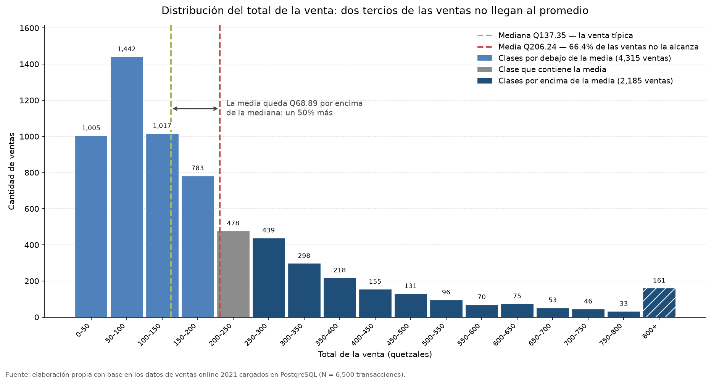
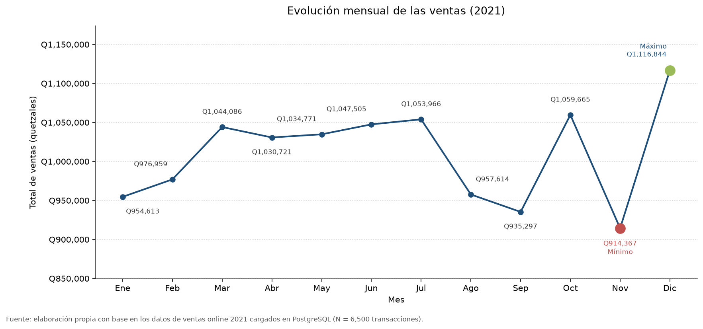
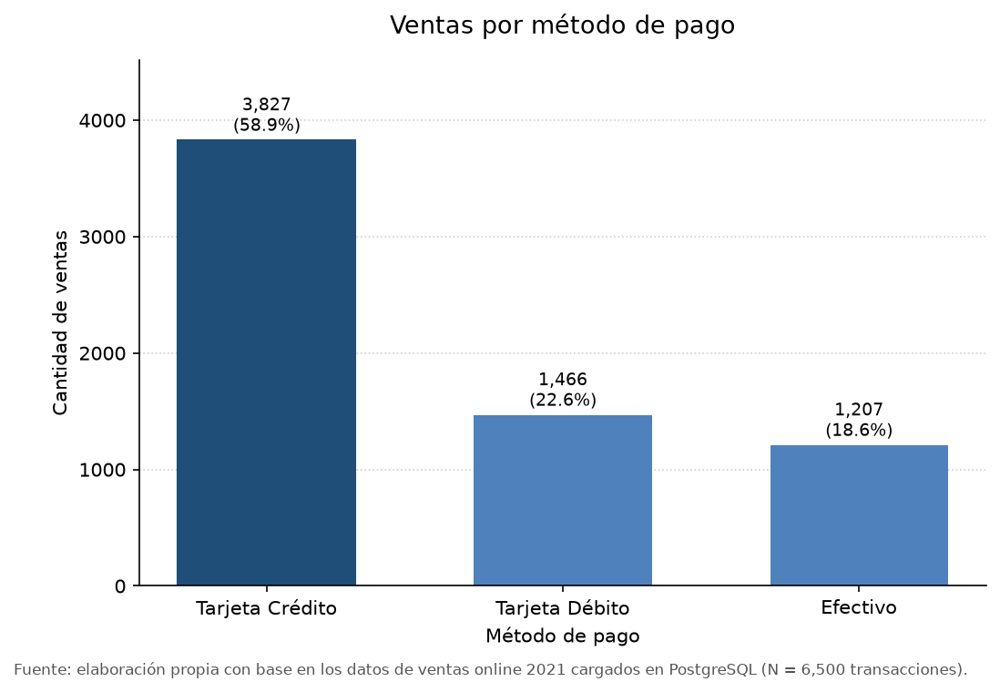
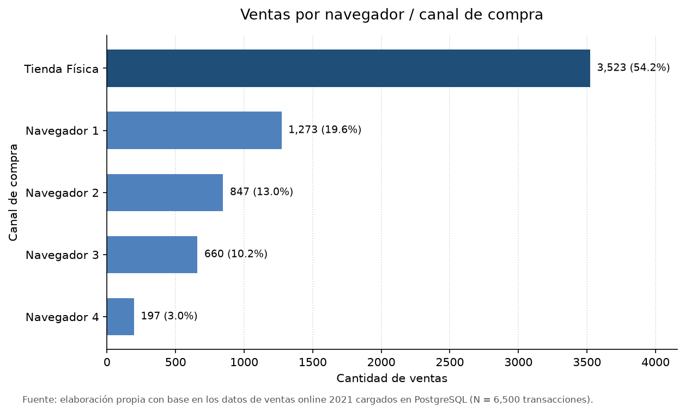
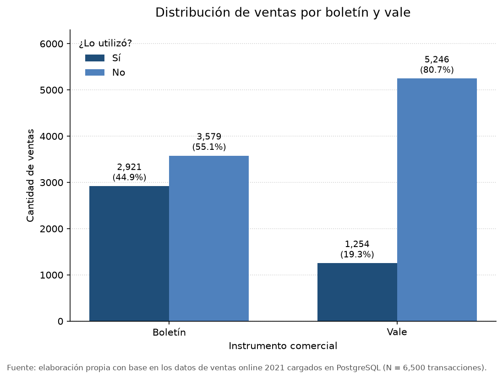
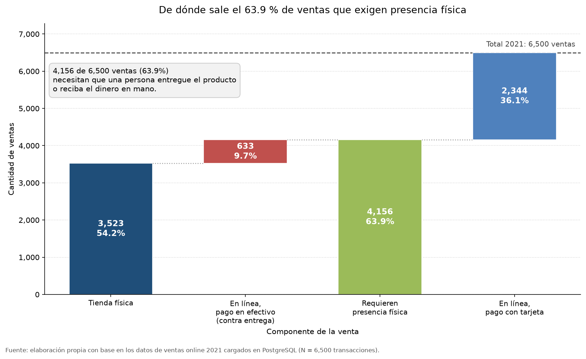
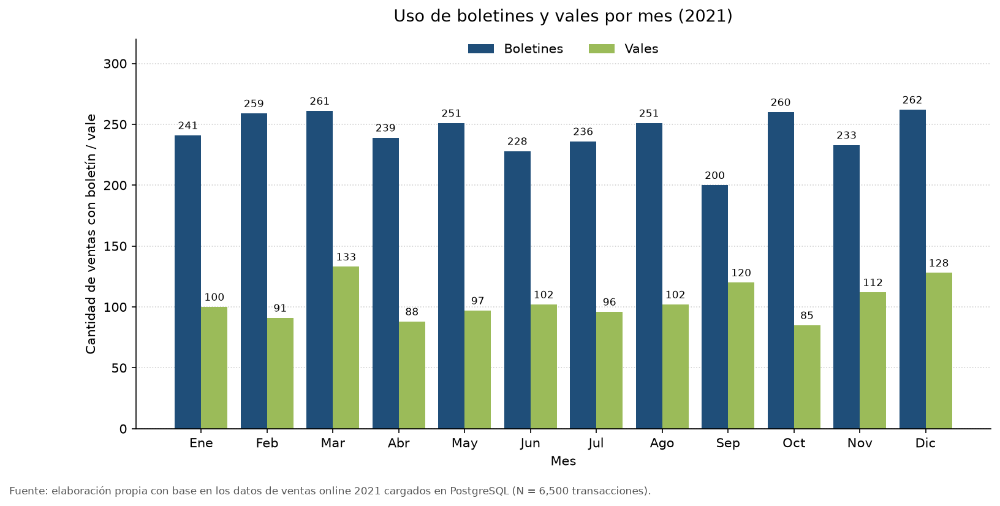

[ ← Regresar ](../README.md)

# Análisis exploratorio y de tendencias

Bloque correspondiente a los puntos **2** y **3** del alcance de la práctica, y a
siete de las doce visualizaciones del punto **6**.

Todas las cifras proceden de consultas SQL ejecutadas contra la base PostgreSQL en la
nube y se reproducen por completo ejecutando:

```bash
python analisis/exploratorio.py
```

## Índice

- [2. Análisis exploratorio](#2-análisis-exploratorio)
  - [2.a Obtención de los datos](#2a-obtención-de-los-datos)
  - [2.b Estadísticas básicas de las variables numéricas](#2b-estadísticas-básicas-de-las-variables-numéricas)
  - [2.c Distribución de las ventas](#2c-distribución-de-las-ventas)
- [3. Análisis de tendencias](#3-análisis-de-tendencias)
  - [3.a Meses con mayores y menores ventas](#3a-meses-con-mayores-y-menores-ventas)
  - [3.b Navegador más preferido y menos popular](#3b-navegador-más-preferido-y-menos-popular)
  - [3.c Ventas pagadas contra entrega o en efectivo](#3c-ventas-pagadas-contra-entrega-o-en-efectivo)
  - [3.d Meses con mayor uso de boletines y vales](#3d-meses-con-mayor-uso-de-boletines-y-vales)
- [Síntesis del bloque](#síntesis-del-bloque)
- [Limitaciones](#limitaciones)

## 2. Análisis exploratorio

### 2.a Obtención de los datos

Los datos se leyeron de la base PostgreSQL en la nube y no del archivo `.csv`
original, tal como pide el enunciado. La agregación se delegó al motor mediante
`GROUP BY`, `SUM`, `COUNT` y `AVG`, de modo que solo viajan a Python unas pocas
decenas de filas ya resumidas.

El universo analizado son **6,500 transacciones** del año 2021, por un total
facturado de **Q1,340,575.80**.

### 2.b Estadísticas básicas de las variables numéricas

| Variable | Media | Mediana | Moda |
| :--- | ---: | ---: | ---: |
| `edad` | 36.31 | 36.00 | 18.00 |
| `venta_total` | 206.24 | 137.35 | 98.00 |
| `num_compra` | 5.09 | 4.00 | 2.00 |
| `monto_compra` | 39.79 | 35.77 | 28.32 |
| `tiempo` | 767.38 | 768.00 | 852.00 |



Tres lecturas importan más que el resto.

**La distribución del gasto está fuertemente sesgada a la derecha.** La media de
`venta_total` es Q206.24 pero la mediana es Q137.35: la media supera a la mediana en
un 50 %. Eso significa que la mitad de las ventas del año no llegó a Q137.35 y que el
promedio está siendo empujado hacia arriba por una minoría de transacciones grandes.
Es un detalle con consecuencias prácticas, porque hablar del «ticket promedio de
Q206» describe mal a la venta típica del negocio. Cada vez que en este informe se
compara un ticket promedio entre dos grupos, conviene recordar que se está comparando
una media sobre una distribución asimétrica; por eso en el bloque de segmentación se
reportan también las medianas.

El histograma pone cifra a esa asimetría. **4,315 ventas —el 66.4 % del año— quedan
por debajo de la media**, de modo que el «promedio» es un valor que dos de cada tres
transacciones no alcanzan. La clase más frecuente es la de Q50 a Q100, con 1,442
ventas, muy por debajo de la media, y a partir de ahí las frecuencias descienden de
forma sostenida sin volver a repuntar. Las 161 ventas de Q800 o más, agrupadas en la
última clase del gráfico, representan apenas el 2.5 % de las transacciones y son las
que arrastran el promedio hacia arriba.

De aquí se desprende una recomendación de lectura para el resto del informe: cuando se
requiera un valor que represente a la venta corriente conviene mirar la mediana, y
reservar la media para los cálculos de facturación total, donde sí corresponde
ponderar por monto.

**La edad se reparte de forma amplia y centrada.** Media de 36.31 años y mediana de
36.00 prácticamente coinciden, señal de una distribución simétrica sin sesgo. La moda
de 18 años no debe leerse como que el cliente típico tenga 18: es simplemente el
extremo inferior del rango observado y, con edades enteras entre 18 y 79, cualquier
valor puntual acumula pocos casos.

**La columna `tiempo` quedó fuera del análisis.** Sus valores se concentran alrededor
de 768 con una dispersión muy baja, pero ni el enunciado ni ningún diccionario de datos
declaran en qué unidad están expresados. Sin esa referencia, el mismo número admite
lecturas que llevarían a conclusiones opuestas, y no existe forma de decidir entre
ellas a partir de la propia columna. Sus estadísticos se reportan por completitud, sin
construir ningún hallazgo sobre ella. La respuesta 8.d recoge este vacío como
recomendación.

### 2.c Distribución de las ventas

El enunciado pide visualizar cinco distribuciones: por mes, método de pago,
navegador, boletín y vale. El criterio con que se eligió cada forma visual está
desarrollado en [`03-metodologia.md`](03-metodologia.md).

#### Por mes



| Mes | Ventas | Total | Promedio |
| :--- | ---: | ---: | ---: |
| Enero | 520 | Q106,059.70 | Q203.96 |
| Febrero | 545 | Q108,962.10 | Q199.93 |
| Marzo | 569 | Q116,168.00 | Q204.16 |
| Abril | 557 | Q116,737.70 | Q209.58 |
| Mayo | 530 | Q112,533.80 | Q212.33 |
| Junio | 543 | Q112,153.90 | Q206.54 |
| Julio | 565 | Q113,645.10 | Q201.14 |
| Agosto | 530 | Q105,665.00 | Q199.37 |
| Septiembre | 508 | Q109,666.70 | Q215.88 |
| Octubre | 563 | Q115,559.60 | Q205.26 |
| Noviembre | 493 | Q99,385.50 | Q201.59 |
| Diciembre | 577 | Q124,038.70 | Q214.97 |

La serie mensual presenta muy poca dispersión. El coeficiente de variación es del
**4.6 %** para el número de transacciones y del **5.5 %** para el monto facturado,
valores que sitúan a los doce meses dentro de una banda estrecha alrededor de su
promedio de 542 transacciones. Los extremos quedan a un 9.0 % por debajo y un 6.5 %
por encima de esa media.

Descomponer el ingreso mensual en sus dos factores aclara de dónde procede lo poco que
varía. El ticket promedio resulta ser la más estable de las tres series, con un
coeficiente de variación de apenas **2.67 %** y un recorrido total de Q16.51 entre
agosto y septiembre. Dicho de otro modo, lo que gasta un cliente se mantiene
prácticamente invariable durante todo el año, y las diferencias de ingreso entre un mes
y otro dependen casi por completo de cuántas transacciones hubo, no de cuánto valió
cada una. Esta descomposición tiene una consecuencia operativa útil: permite seguir el
desempeño mensual contando transacciones, sin necesidad de corregir por valor.

#### Por método de pago



| Método | Ventas | % | Total | Promedio |
| :--- | ---: | ---: | ---: | ---: |
| Tarjeta de crédito | 3,827 | 58.9 % | Q786,772.50 | Q205.58 |
| Tarjeta de débito | 1,466 | 22.6 % | Q309,301.80 | Q210.98 |
| Efectivo | 1,207 | 18.6 % | Q244,501.50 | Q202.57 |

La tarjeta de crédito domina con casi seis de cada diez ventas. Lo llamativo no es el
reparto sino la última columna: los tres tickets promedio caben en un rango de Q8.41,
un 4.2 %. El método de pago dice mucho sobre **cómo** cobra la empresa y casi nada
sobre **cuánto** gasta el cliente.

Ese 18.6 % de efectivo es la respuesta directa al punto 3.c y se desarrolla más
abajo.

#### Por navegador o canal



| Canal | Ventas | % | Total | Promedio |
| :--- | ---: | ---: | ---: | ---: |
| Tienda física | 3,523 | 54.2 % | Q719,298.50 | Q204.17 |
| Navegador 1 | 1,273 | 19.6 % | Q276,221.80 | Q216.98 |
| Navegador 2 | 847 | 13.0 % | Q175,415.60 | Q207.10 |
| Navegador 3 | 660 | 10.2 % | Q132,472.20 | Q200.72 |
| Navegador 4 | 197 | 3.0 % | Q37,167.70 | Q188.67 |

Aquí aparece el primer hallazgo estructural del informe: **la tienda física concentra
el 54.2 % de las transacciones del año**, frente al 45.8 % que reparten entre sí los
cuatro navegadores con 2,977 ventas. El enunciado presenta el punto de venta presencial
como la expansión reciente de un negocio nacido en línea, pero los registros de 2021 lo
muestran ya como el canal mayoritario durante los doce meses del ejercicio. La
conclusión clave 4 desarrolla lo que esto implica para la operación.

Dentro de lo digital la concentración es alta: sobre esas 2,977 ventas en línea, el
Navegador 1 acumula el 42.8 % y el Navegador 4 no llega al 7 %. Una relación de más de
seis a uno entre el primero y el último del ranking. La respuesta 8.c retoma este
contraste para discutir la asignación del esfuerzo técnico.

El ticket sí varía algo más entre canales que entre métodos de pago: del Q216.98 del
Navegador 1 al Q188.67 del Navegador 4 hay Q28.31 de diferencia. Conviene no
sobreinterpretarlo, porque el Navegador 4 tiene la base más pequeña de la tabla y sus
promedios son los menos estables.

#### Por boletín y vale



| Boletín | Vale | Ventas | % | Ticket promedio |
| :---: | :---: | ---: | ---: | ---: |
| No | No | 3,136 | 48.2 % | Q183.33 |
| No | Sí | 443 | 6.8 % | Q170.66 |
| Sí | No | 2,110 | 32.5 % | Q233.80 |
| Sí | Sí | 811 | 12.5 % | Q242.57 |

Agregando cada instrumento por separado, el boletín aparece en **2,921 ventas
(44.9 %)** y el vale en **1,254 (19.3 %)**, una proporción de 2.3 a 1 a favor del
primero.

La columna del ticket ya anticipa lo que el bloque de segmentación confirma con
detalle en [`11-segmentacion-correlacion.md`](11-segmentacion-correlacion.md): las dos
filas con boletín se despegan claramente de las dos sin él, mientras que el vale por sí
solo no ordena nada.

## 3. Análisis de tendencias

### 3.a Meses con mayores y menores ventas

| | Mes | Ventas | Facturación |
| :--- | :--- | ---: | ---: |
| **Mayores ventas** | Diciembre | 577 | Q124,038.70 |
| **Menores ventas** | Noviembre | 493 | Q99,385.50 |

Los dos criterios posibles —cantidad de transacciones y monto facturado— señalan el
mismo par de meses, de modo que la respuesta no depende de cuál se adopte. Conviene
comprobarlo antes de afirmarlo, porque no tenía por qué ocurrir: un mes de muchas
ventas pequeñas podría facturar menos que otro de pocas ventas grandes. Que ambos
ordenamientos coincidan se explica por la estabilidad del ticket documentada en el
punto 2.c.

Medidos contra el promedio anual, diciembre se ubica un 6.5 % por encima y noviembre un
9.0 % por debajo. La distancia entre ambos es de 84 transacciones y Q24,653.20, la
mayor que separa a dos meses cualesquiera del ejercicio.

Un rasgo del calendario merece registrarse porque una tabla ordenada por volumen no lo
deja ver: los dos meses extremos del año son consecutivos. Su lectura comercial y la
acción que se deriva de ella corresponden a la conclusión clave 4 y a su primera
recomendación.

### 3.b Navegador más preferido y menos popular

| | Canal | Ventas | % |
| :--- | :--- | ---: | ---: |
| Canal más usado en general | Tienda física | 3,523 | 54.2 % |
| **Navegador más preferido** | **Navegador 1** | **1,273** | **19.6 %** |
| **Navegador menos popular** | **Navegador 4** | **197** | **3.0 %** |

La respuesta se entrega en dos niveles a propósito. El registro de canal mezcla dos
naturalezas distintas: cuatro navegadores web y un punto de venta presencial. La tienda
física encabeza el conteo total, pero incluirla en un ranking de navegadores
respondería una pregunta que el enunciado no formula. Restringiendo la comparación a lo
que sí son navegadores, el primero es el Navegador 1 y el último el Navegador 4, con
una razón de 6.5 a 1 entre ambos extremos.

Sobre el fondo de esa cifra hay que ser prudente. La codificación del canal es
puramente ordinal —del 1 al 4— y no revela de qué producto se trata en cada caso. Un
volumen bajo admite al menos dos explicaciones incompatibles entre sí: poca base de
usuarios, o una base normal con fricción en algún paso del proceso de compra. Elegir
entre ambas requiere información que el conjunto de datos no contiene, así que este
punto se responde con el ranking y se detiene ahí. La respuesta 8.d recoge el dato
faltante que permitiría resolverlo.

### 3.c Ventas pagadas contra entrega o en efectivo

> **Criterio aplicado.** El auxiliar del curso aclaró que se toma el valor 0 tanto
> para efectivo como para contra entrega, y que los pagos con tarjeta de crédito o
> débito no se consideran contra entrega. La respuesta es, entonces, el total de
> ventas con `MetodoPago = 0`.

| Concepto | Valor |
| :--- | ---: |
| **Ventas contra entrega o en efectivo** | **1,207 de 6,500 (18.6 %)** |
| Monto acumulado | Q244,501.50 de Q1,340,575.80 (18.2 %) |

El resultado del punto es, entonces, 1,207 transacciones: el 18.6 % del volumen anual y
el 18.2 % del monto. Que ambos porcentajes casi coincidan indica que las ventas en
efectivo no son sistemáticamente mayores ni menores que el resto; su ticket promedio es
de Q202.57 contra los Q206.24 generales.

A ese total se le añadió un desglose que ninguna columna entrega por sí sola y que
exigió cruzar el método de pago con el canal de origen:

| Origen | Ventas | % del efectivo | Monto |
| :--- | ---: | ---: | ---: |
| Navegador (cobro en la entrega) | 633 | 52.4 % | Q129,138.10 |
| Tienda física (cobro en caja) | 574 | 47.6 % | Q115,363.40 |

La partición se apoya en una regla única: si una compra se originó en un navegador y se
liquidó en efectivo, el dinero no pudo ingresar por caja, y la única vía operativa para
recibirlo es el domicilio del comprador en el momento de la entrega. Bajo ese criterio,
**633 transacciones —el 21.3 % de las ventas en línea— constituyen pago contra entrega
en sentido estricto**, mientras que las 574 restantes son cobro presencial.

Corresponde marcar con precisión dónde termina el dato y dónde empieza la inferencia,
porque capítulos posteriores se apoyan en ambos. El conteo de 1,207 proviene sin
intermediación del campo `MetodoPago` y es verificable en la base. El reparto 633/574,
en cambio, se deduce del canal de origen y descansa en el supuesto de que el efectivo
no se cobra a distancia: es razonable y difícil de sostener de otro modo, pero sigue
siendo un supuesto. El peso que esta cifra tiene sobre la estructura operativa del
negocio se desarrolla en la conclusión clave 4.



El gráfico de cascada muestra la aritmética completa de ese hallazgo, que de otro modo
habría que aceptar como un total ya calculado. A las 3,523 ventas de tienda física se
suman las 633 en línea cobradas en la entrega, y ambas conforman **4,156 transacciones
—el 63.9 % del año— que requieren que alguien entregue el producto o reciba el dinero
en persona**. El remanente, 2,344 ventas pagadas con tarjeta desde un navegador, es el
36.1 % que se resuelve por completo sin intervención presencial.

La descomposición deja a la vista algo que el porcentaje agregado esconde: de esas
4,156 transacciones, 3,523 son dato directo del campo de canal y solo 633 dependen del
supuesto descrito arriba. Aun descartando por completo el componente inferido, la
tienda física por sí sola ya supera la mitad del año.

### 3.d Meses con mayor uso de boletines y vales



| Mes | Ventas | Boletines | % | Vales | % |
| :--- | ---: | ---: | ---: | ---: | ---: |
| Enero | 520 | 241 | 46.3 % | 100 | 19.2 % |
| Febrero | 545 | 259 | 47.5 % | 91 | 16.7 % |
| Marzo | 569 | 261 | 45.9 % | **133** | 23.4 % |
| Abril | 557 | 239 | 42.9 % | 88 | 15.8 % |
| Mayo | 530 | 251 | 47.4 % | 97 | 18.3 % |
| Junio | 543 | 228 | 42.0 % | 102 | 18.8 % |
| Julio | 565 | 236 | 41.8 % | 96 | 17.0 % |
| Agosto | 530 | 251 | 47.4 % | 102 | 19.2 % |
| Septiembre | 508 | 200 | 39.4 % | 120 | 23.6 % |
| Octubre | 563 | 260 | 46.2 % | 85 | 15.1 % |
| Noviembre | 493 | 233 | 47.3 % | 112 | 22.7 % |
| Diciembre | 577 | **262** | 45.4 % | 128 | 22.2 % |

**La respuesta al punto** es diciembre para los boletines, con 262 compras asociadas, y
marzo para los vales, con 133.

Los dos máximos no tienen la misma solidez, y omitirlo daría una falsa sensación de
precisión. El de los vales es nítido: marzo (133) supera al segundo, diciembre (128),
por cinco compras, y al tercero, septiembre (120), por trece. El de los boletines es un
empate técnico: diciembre registra 262, marzo 261 y octubre 260. Tres unidades separan
al primero del tercero sobre bases mensuales superiores a las quinientas ventas, de
manera que designar a diciembre como el mes de mayor uso de boletines es correcto pero
frágil, y una variación mínima en los datos reordenaría el podio. La respuesta se
entrega tal como la arroja el cálculo, con esta advertencia al lado.

Calculada sobre las doce parejas mensuales, la correlación entre ambas series es de
**−0.077**, indistinguible de cero. Los meses que mejor lo ilustran son estos:

| Mes | Tasa de boletín | Tasa de vale |
| :--- | ---: | ---: |
| Septiembre | 39.4 % — mínima del año | 23.6 % — máxima del año |
| Octubre | 46.2 % — por encima del promedio | 15.1 % — mínima del año |
| Noviembre | 47.3 % — de las más altas | 22.7 % — de las más altas |

Cada uno combina los dos indicadores de una forma distinta, sin que un valor alto en
una columna anticipe nada sobre la otra. Noviembre añade un contraste propio: reúne una
de las coberturas de boletín más altas del ejercicio y es, al mismo tiempo, el mes de
menor volumen de ventas. La interpretación de este desacople y sus implicaciones para
la planificación comercial se abordan en la conclusión clave 4.

## Síntesis del bloque

Cuatro hallazgos se sostienen sobre los puntos 2 y 3 y alimentan el resto del informe:

| Hallazgo | Cifra | Dónde se desarrolla |
| :--- | :--- | :--- |
| La operación es mayoritariamente presencial | 63.9 % de las ventas requieren presencia física | Conclusión clave 4 |
| El año no tiene estacionalidad | 493 a 577 ventas por mes, promedio 542 | Conclusión clave 4 |
| Noviembre es el bache justo antes del pico | 84 transacciones menos que diciembre | Recomendación clave 4, acción 1 |
| Boletín y vale se mueven descoordinados | correlación mensual de −0.077 | Conclusión clave 4 |

A esto se suma un resultado en negativo que conviene enunciar: ni el método de pago ni
el mes explican diferencias relevantes de gasto. Los tickets promedio se mantienen
entre Q199 y Q216 se mire por donde se mire. La única variable que sí separa clientes
por gasto aparece en el bloque siguiente, y es la suscripción al boletín.

## Limitaciones

1. **Un único ejercicio observado.** Toda la descripción se apoya en 2021. Sin años
   anteriores ni posteriores no hay forma de distinguir una pauta recurrente de una
   particularidad de ese ejercicio, por lo que las regularidades mensuales se reportan
   como observadas y no como estacionales.
2. **Faltan las variables explicativas.** No se registran campañas activas, inversión
   publicitaria ni costos por canal. El bloque puede establecer qué ocurrió, pero no
   atribuirlo a una causa identificable.
3. **La columna `tiempo` carece de unidad declarada.** Quedó excluida de toda
   interpretación, con la pérdida de una variable completa del conjunto.
4. **La codificación del canal es ordinal y opaca.** Los identificadores del 1 al 4 no
   informan de qué navegador, dispositivo o aplicación se trata, lo que impide
   diagnosticar la causa de un volumen bajo.
5. **El desglose del efectivo es inferido, no medido.** El conteo total de pagos en
   efectivo se verifica directamente en la base; su partición entre cobro en caja y
   cobro a domicilio se deduce del canal de origen, porque ningún campo la registra.
6. **Sin producto ni costo no cabe hablar de rentabilidad.** El bloque completo se
   construye sobre ingresos, lo que obliga a dar por sentado que vender más siempre es
   preferible. La respuesta 8.d detalla los datos que cerrarían este vacío.
